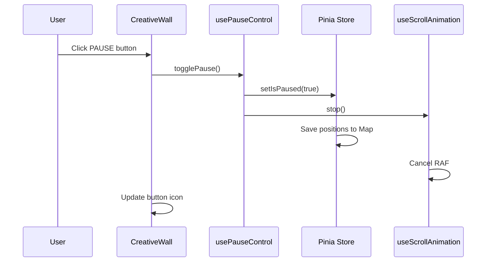

# Creative Wall PAUSE機能 詳細設計書

## 1. 設計概要

### 1.1 目的
requirement.mdに定義された要件を満たすPAUSE機能を実装する。

### 1.2 要件解釈と実装アプローチ
**重要**: 現在の実装はrequestAnimationFrameベースでアイテムの位置を更新しており、CSSアニメーションを使用していません。
そのため、要件のEVT-001/EVT-002で指定されている「CSS animation-play-state」は適用できません。
代わりに、requestAnimationFrameループの停止/再開で同等の機能を実現します。

| 要件 | 解釈 | 実装方法 |
|------|------|---------|
| EVT-001/002 (animation-play-state) | アニメーション停止の意図 | requestAnimationFrameの停止 |
| EVT-004 (Map<string, number>) | translateX値のみ保存 | 位置のx座標のみをMapに保存 |
| STA-001 (animation-play-state=paused) | 停止状態の維持 | isRunning=falseの維持 |

### 1.3 設計方針
- **最小侵襲性**: 既存コードへの変更を最小限に抑える
- **パフォーマンス優先**: 60fps維持、50ms以内の応答時間
- **型安全性**: TypeScript型定義の完全性
- **拡張性**: 将来的な機能追加を考慮

### 1.4 技術選択の根拠
| 選択 | 理由 |
|------|------|
| requestAnimationFrameの制御 | 現在の実装と整合性があり、正確な位置制御が可能 |
| Piniaストアでの状態管理 | 既存アーキテクチャとの整合性 |
| Composition API | リアクティブな状態管理と再利用性 |

## 2. アーキテクチャ設計

### 2.1 レイヤー構成
```
┌─────────────────────────────────────────┐
│     UI層 (CreativeWall.vue)             │
│  - PAUSEボタン表示                       │
│  - キーボードイベント処理                │
└─────────────────────────────────────────┘
                    ↕
┌─────────────────────────────────────────┐
│   Composable層 (usePauseControl.ts)     │
│  - PAUSE制御ロジック                     │
│  - アニメーション制御                    │
└─────────────────────────────────────────┘
                    ↕
┌─────────────────────────────────────────┐
│     Store層 (scrollItems.ts)            │
│  - isPaused状態管理                      │
│  - pausedPositions管理                   │
└─────────────────────────────────────────┘
                    ↕
┌─────────────────────────────────────────┐
│  Animation層 (useScrollAnimation.ts)    │
│  - requestAnimationFrame制御             │
│  - 位置更新ロジック                      │
└─────────────────────────────────────────┘
```

### 2.2 データフロー


## 3. 詳細設計

### 3.1 Piniaストア拡張

#### 3.1.1 型定義の追加
```typescript
// src/stores/scrollItems.ts に追加

interface PauseState {
  isPaused: boolean
  pausedPositions: Map<string, number>  // itemId -> translateX value (要件通り)
  pauseTimestamp: number | null
}
```

#### 3.1.2 状態の追加
```typescript
// State section に追加
const isPaused = ref(false)
const pausedPositions = ref(new Map<string, number>())  // translateX値のみ保存
const pauseTimestamp = ref<number | null>(null)
```

#### 3.1.3 アクションの追加
```typescript
// Actions section に追加

/**
 * PAUSE状態を設定
 * @param paused PAUSE状態
 */
function setIsPaused(paused: boolean): void {
  const previousState = isPaused.value
  isPaused.value = paused
  
  if (paused && !previousState) {
    // PAUSE開始時: translateX値を保存
    pauseTimestamp.value = Date.now()
    items.value.forEach(item => {
      pausedPositions.value.set(item.id, item.position.x)  // EVT-004準拠
    })
  } else if (!paused && previousState) {
    // PAUSE解除時: タイムスタンプクリア
    pauseTimestamp.value = null
  }
}

/**
 * PAUSE状態をトグル
 */
function togglePause(): void {
  setIsPaused(!isPaused.value)
}

/**
 * 保存されたtranslateX値を取得
 * @param id アイテムID
 */
function getPausedPositionX(id: string): number | undefined {
  return pausedPositions.value.get(id)
}
```

#### 3.1.4 エクスポートの追加
```typescript
// return文に追加
return {
  // State
  items,
  isPaused,           // 追加
  pausedPositions,    // 追加
  pauseTimestamp,     // 追加
  globalVelocity,
  itemCount,
  showTexts,
  boardWidth,
  boardHeight,
  
  // Getters
  imageItems,
  textItems,
  visibleItems,
  itemsCount,
  speedMultiplier,
  
  // Actions
  setIsPaused,        // 追加
  togglePause,        // 追加
  getPausedPositionX, // 追加
  // ... 既存のアクション
}
```

### 3.2 Composable実装

#### 3.2.1 usePauseControl.ts
```typescript
// src/composables/usePauseControl.ts

import { computed, onMounted, onUnmounted } from 'vue'
import { useScrollItemsStore } from '@/stores/scrollItems'

export interface UsePauseControlReturn {
  isPaused: ReturnType<typeof computed<boolean>>
  pauseIcon: ReturnType<typeof computed<string>>
  togglePause: () => void
  pause: () => void
  resume: () => void
}

export function usePauseControl(
  animationController: {
    stop: () => void
    start: () => void
    isRunning: { value: boolean }
  }
): UsePauseControlReturn {
  const store = useScrollItemsStore()
  
  const isPaused = computed(() => store.isPaused)
  
  const pauseIcon = computed(() => 
    store.isPaused ? 'mdi-play' : 'mdi-pause'
  )
  
  const pause = (): void => {
    if (!store.isPaused) {
      const startTime = performance.now()
      
      // CPX-001: 順序処理と時間要件
      // 1. isPausedをtrueに設定（5ms以内）
      store.setIsPaused(true)
      
      // 2. アニメーション停止（20ms以内は内部で保証）
      animationController.stop()
      
      // 総実行時間チェック（PER-001: 50ms未満）
      if (import.meta.env.DEV) {
        const elapsed = performance.now() - startTime
        console.assert(elapsed < 50, `PAUSE処理が${elapsed}ms`)
      }
    }
  }
  
  const resume = (): void => {
    if (store.isPaused) {
      // EVT-005: 保存された位置から再開
      store.setIsPaused(false)
      animationController.start()
    }
  }
  
  const togglePause = (): void => {
    if (store.isPaused) {
      resume()
    } else {
      pause()
    }
  }
  
  // キーボードショートカット
  const handleKeydown = (e: KeyboardEvent): void => {
    // スペースキー && テキスト入力フィールドでない
    if (e.code === 'Space' && 
        !(e.target instanceof HTMLInputElement) &&
        !(e.target instanceof HTMLTextAreaElement)) {
      e.preventDefault()
      togglePause()
    }
  }
  
  onMounted(() => {
    window.addEventListener('keydown', handleKeydown)
  })
  
  onUnmounted(() => {
    window.removeEventListener('keydown', handleKeydown)
  })
  
  return {
    isPaused,
    pauseIcon,
    togglePause,
    pause,
    resume
  }
}
```

### 3.3 UIコンポーネント変更

#### 3.3.1 CreativeWall.vueのtemplate部分
```vue
<template>
  <div class="app-container">
    <div v-if="!loading && !error" class="controls-container">
      <!-- PAUSEボタンを追加 -->
      <button 
        id="pause-button"
        class="pause-button"
        :aria-pressed="pauseControl.isPaused.value"
        :aria-label="pauseControl.isPaused.value ? '再生' : '一時停止'"
        @click="pauseControl.togglePause"
      >
        <i :class="pauseControl.pauseIcon.value" />
      </button>
      
      <!-- 既存のコントロール -->
      <button class="toggle-text-btn" @click="scrollItemsStore.toggleTexts()">
        {{ scrollItemsStore.showTexts ? 'テキストを隠す' : 'テキストを表示' }}
      </button>
      <!-- ... 他のコントロール ... -->
    </div>
    <!-- ... -->
  </div>
</template>
```

#### 3.3.2 CreativeWall.vueのscript部分
```typescript
// Import追加
import { usePauseControl } from '@/composables/usePauseControl'

// Setup内に追加
const pauseControl = usePauseControl(animationController)

// onMountedの修正
onMounted(async () => {
  await initializeApp()
  
  // PAUSE状態でない場合のみアニメーション開始
  if (!scrollItemsStore.isPaused) {
    animationController.start()
  }
  
  window.addEventListener('resize', handleResize)
  window.addEventListener('resize', animationController.handleResize)
})
```

#### 3.3.3 アイコンの追加設定
```typescript
// Material Design Iconsを使用するため、@mdi/fontが必要
// package.jsonに既に含まれている場合は不要
import '@mdi/font/css/materialdesignicons.css'
```

### 3.3.4 CreativeWall.vueのstyle部分
```css
.pause-button {
  padding: 10px;
  width: 44px;
  height: 44px;
  background: rgba(255, 255, 255, 0.9);
  border: 2px solid #333;
  border-radius: 8px;
  font-size: 20px;
  cursor: pointer;
  transition: all 0.3s ease;
  box-shadow: 0 2px 8px rgba(0, 0, 0, 0.2);
  display: flex;
  align-items: center;
  justify-content: center;
}

.pause-button:hover {
  background: rgba(255, 255, 255, 1);
  transform: translateY(-2px);
  box-shadow: 0 4px 12px rgba(0, 0, 0, 0.3);
}

.pause-button:active {
  transform: translateY(0);
}

.pause-button[aria-pressed="true"] {
  background: rgba(100, 200, 100, 0.9);
}

.pause-button i {
  font-size: 24px;
  color: currentColor;
}
```

### 3.4 新規アイテム追加時の処理（STA-004）

#### 3.4.1 ScrollItemFactoryの修正
```typescript
// src/factories/ScrollItemFactory.ts に追加

createImageItem(data: FetchedImage, index: number, baseVelocity: number): ScrollItem {
  const store = useScrollItemsStore()
  const item = {
    // ... 既存のアイテム生成ロジック
  }
  
  // STA-004: PAUSE中の新規アイテムは停止状態で追加
  if (store.isPaused) {
    // 新規アイテムの位置を記録
    store.pausedPositions.set(item.id, item.position.x)
  }
  
  return item
}
```

### 3.5 速度調整時の処理（CPX-002）

#### 3.5.1 CreativeWall.vueの修正
```typescript
const updateGlobalSpeed = (): void => {
  // CPX-002: isPaused=true時も速度は更新するがアニメーションは開始しない
  velocityService.setGlobalMultiplier(scrollItemsStore.globalVelocity)
  scrollItemsStore.updateAllVelocities(velocityService)
  
  // PAUSE中は再開しない
  if (!scrollItemsStore.isPaused) {
    // アニメーション中のみ速度変更を適用
  }
}
```

### 3.6 アニメーション制御の修正

#### 3.6.1 Web Worker対応
```typescript
// CreativeWall.vueでの判定ロジック
const animationController = PERFORMANCE_FLAGS.USE_WEB_WORKER
  ? useScrollAnimationWorker(positionService)  // Worker版
  : useScrollAnimation(positionService)         // 通常版
```

#### 3.6.2 useScrollAnimation.tsの修正
```typescript
// animateメソッドの修正
const animate = (currentTime: number): void => {
  // PAUSE中はrequestAnimationFrameを継続するが位置更新をスキップ
  if (!isRunning.value || store.isPaused) {
    // 次フレームは要求するが処理はスキップ
    animationFrameId = requestAnimationFrame(animate)
    return
  }
  
  // 既存のアニメーションロジック
  const deltaTime = Math.min((currentTime - lastTime) / 1000, 0.1)
  lastTime = currentTime
  // ...
  animationFrameId = requestAnimationFrame(animate)
}

// startメソッドの修正
const start = (): void => {
  // PAUSE中は開始しない
  if (!isRunning.value && !store.isPaused) {
    isRunning.value = true
    lastTime = performance.now()
    frameCount = 0
    lastFpsUpdate = performance.now()
    animationFrameId = requestAnimationFrame(animate)
  }
}
```

## 4. テスト設計

### 4.1 単体テスト

#### 4.1.1 Piniaストアテスト
```typescript
// src/stores/__tests__/scrollItems.spec.ts に追加

describe('PAUSE機能', () => {
  it('setIsPausedがtrueで位置を保存する', () => {
    const store = useScrollItemsStore()
    const item = createMockItem()
    store.addItem(item)
    
    store.setIsPaused(true)
    
    expect(store.isPaused).toBe(true)
    expect(store.pausedPositions.get(item.id)).toEqual(item.position.x)
    expect(store.pauseTimestamp).toBeTruthy()
  })
  
  it('togglePauseが状態を切り替える', () => {
    const store = useScrollItemsStore()
    const initial = store.isPaused
    
    store.togglePause()
    expect(store.isPaused).toBe(!initial)
    
    store.togglePause()
    expect(store.isPaused).toBe(initial)
  })
})
```

#### 4.1.2 Composableテスト
```typescript
// src/composables/__tests__/usePauseControl.spec.ts

describe('usePauseControl', () => {
  it('スペースキーでPAUSEをトグルする', async () => {
    const mockController = {
      stop: vi.fn(),
      start: vi.fn(),
      isRunning: { value: true }
    }
    
    const { togglePause } = usePauseControl(mockController)
    
    const event = new KeyboardEvent('keydown', { code: 'Space' })
    window.dispatchEvent(event)
    
    await nextTick()
    expect(mockController.stop).toHaveBeenCalled()
  })
  
  it('50ms以内に処理を完了する', async () => {
    const start = performance.now()
    const { pause } = usePauseControl(mockController)
    
    pause()
    
    const elapsed = performance.now() - start
    expect(elapsed).toBeLessThan(50)
  })
})
```

### 4.2 E2Eテスト
```typescript
// e2e/pause.spec.ts

test('PAUSEボタンクリックで全アイテムが停止', async ({ page }) => {
  await page.goto('/')
  await page.waitForSelector('.scroll-item')
  
  // 初期位置を記録
  const initialPositions = await page.evaluate(() => {
    return Array.from(document.querySelectorAll('.scroll-item')).map(el => {
      const transform = window.getComputedStyle(el).transform
      return { id: el.getAttribute('data-item-id'), transform }
    })
  })
  
  // PAUSEボタンクリック
  await page.click('#pause-button')
  
  // 100ms待機
  await page.waitForTimeout(100)
  
  // 位置が変化していないことを確認
  const afterPositions = await page.evaluate(() => {
    return Array.from(document.querySelectorAll('.scroll-item')).map(el => {
      const transform = window.getComputedStyle(el).transform
      return { id: el.getAttribute('data-item-id'), transform }
    })
  })
  
  expect(afterPositions).toEqual(initialPositions)
})
```

## 5. パフォーマンス設計

### 5.1 メモリ管理
- pausedPositions MapはPAUSE解除時にクリアしない（再PAUSE時の参照用）
- 最大100アイテム × 8バイト(translateX値のみ) = 約800バイト

### 5.2 処理時間
| 処理 | 目標時間 | 実装方法 |
|------|---------|---------|
| PAUSE切り替え | <50ms | 直接的な状態更新 |
| 位置保存 | <10ms | Map.set使用 |
| アイコン更新 | <5ms | computed使用 |

### 5.3 最適化
- requestAnimationFrameの早期リターン
- 不要なレンダリング防止
- イベントリスナーの適切な管理

## 6. リスク対策の実装

### 6.1 translateX位置のずれ対策（R-001）
```typescript
// 位置保存時にgetComputedStyleで正確な値を取得
function savePositions(): void {
  items.value.forEach(item => {
    const element = document.querySelector(`[data-item-id="${item.id}"]`)
    if (element) {
      const computed = window.getComputedStyle(element)
      const matrix = new DOMMatrix(computed.transform)
      pausedPositions.value.set(item.id, matrix.m41) // translateX値
    }
  })
}
```

### 6.2 メモリリーク対策（R-002）
```typescript
// WeakMapの使用を検討（ただし現在はMapで問題なし）
// アイテム削除時に必ずMapからも削除
function removeItem(id: string): void {
  items.value = items.value.filter(item => item.id !== id)
  itemsMap.value.delete(id)
  pausedPositions.value.delete(id) // メモリリーク防止
}
```

### 6.3 イベント競合対策（R-003）
```typescript
// デバウンス処理の実装
import { debounce } from 'lodash-es'

const debouncedToggle = debounce(() => {
  togglePause()
}, 50)

// キーボードイベントでデバウンス版を使用
const handleKeydown = (e: KeyboardEvent): void => {
  if (e.code === 'Space' && !isInputElement(e.target)) {
    e.preventDefault()
    debouncedToggle()
  }
}
```

## 7. セキュリティ考慮事項

### 7.1 入力検証
- キーボードイベントのtarget要素確認
- preventDefaultによるデフォルト動作抑制

### 7.2 状態の整合性
- アトミックな状態更新
- 競合状態の防止

## 8. 実装順序

### Phase 1: 基本機能（必須）
1. Piniaストアの拡張
2. usePauseControlの実装
3. UIボタンの追加
4. アニメーション制御の修正

### Phase 2: 品質向上（推奨）
1. 単体テストの実装
2. E2Eテストの実装
3. パフォーマンス計測

### Phase 3: 拡張機能（オプション）

#### OPT-001: オーバーレイ表示
```vue
<!-- BlackBoard.vueに追加 -->
<div v-if="store.isPaused && pauseOverlay" class="pause-overlay" />

<style>
.pause-overlay {
  position: absolute;
  top: 0;
  left: 0;
  right: 0;
  bottom: 0;
  background: rgba(0, 0, 0, 0.3);
  pointer-events: none;
  z-index: 9999;
}
</style>
```

#### OPT-002: トランジション効果
```css
.pause-button {
  transition: all 200ms ease; /* transitionEnabled=true時 */
}
```

#### OPT-003: ホバー効果
```css
.scroll-item.paused:hover {
  opacity: 0.8;
  cursor: pointer;
}
```

## 9. 移行計画

### 9.1 既存コードへの影響
| ファイル | 変更内容 | リスク |
|---------|---------|--------|
| scrollItems.ts | 状態追加 | 低 |
| CreativeWall.vue | UI追加 | 低 |
| useScrollAnimation.ts | 条件追加 | 低 |

### 9.2 後方互換性
- 既存APIは変更しない
- 新規プロパティはオプショナル
- デフォルト値で既存動作を維持

### 9.3 独立性の保証（COM-001, COM-002）
```typescript
// 速度調整の独立性（COM-001）
function updateGlobalVelocity(velocity: number): void {
  globalVelocity.value = velocity
  // isPausedには一切触れない
}

// テキスト表示の独立性（COM-002）
function toggleTexts(): void {
  showTexts.value = !showTexts.value
  // isPausedには一切触れない
}

// PAUSE機能側も他の状態に影響しない
function setIsPaused(paused: boolean): void {
  isPaused.value = paused
  // globalVelocity, showTextsには触れない
}
```

## 10. 監視とログ

### 10.1 監視項目
```typescript
// パフォーマンスログ
logger.debug('PAUSE toggled', {
  isPaused: store.isPaused,
  itemCount: store.items.length,
  elapsed: performance.now() - startTime
})
```

### 10.2 エラーハンドリング
```typescript
try {
  store.setIsPaused(true)
  animationController.stop()
} catch (error) {
  logger.error('Failed to pause animation', error)
  // フォールバック処理
}
```

## 11. 検証基準

### 11.1 機能検証
- [ ] PAUSEボタンクリックで停止
- [ ] 再クリックで再開
- [ ] スペースキーで切り替え
- [ ] アイコンが正しく変更
- [ ] 位置のズレが±5px以内

### 11.2 性能検証
- [ ] 応答時間 <50ms
- [ ] 60fps維持
- [ ] メモリ増加 <5%

### 11.3 品質検証
- [ ] TypeScript型エラー 0件
- [ ] ビルド成功
- [ ] 全テスト合格

## 12. 依存関係

### 12.1 外部ライブラリ
- @mdi/font: アイコンフォント（既存）
- pinia: 状態管理（既存）
- vue: フレームワーク（既存）

### 12.2 内部モジュール
```
usePauseControl
  ├── scrollItems (store)
  ├── useScrollAnimation
  └── logger (utils)
```

## 13. 設定ファイル更新

### 13.1 TypeScript設定
変更不要（既存設定で対応可能）

### 13.2 ESLint設定
変更不要（既存設定で対応可能）

### 13.3 Vite設定
変更不要（既存設定で対応可能）